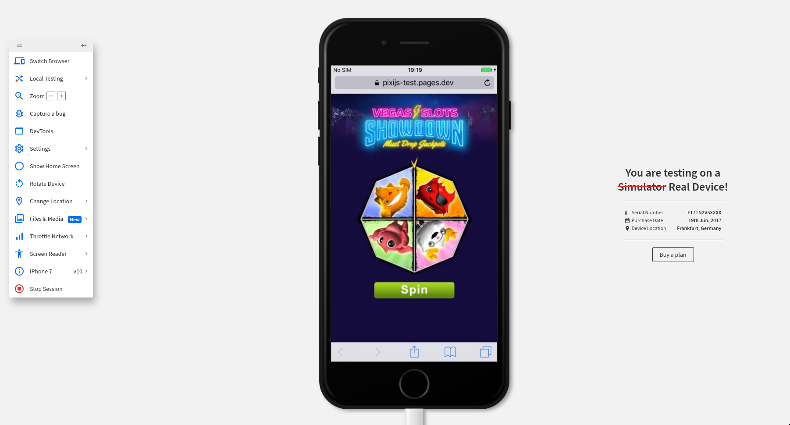

# Pixi.js test task

**TL;DR:** [pixijs-test.pages.dev](https://pixijs-test.pages.dev)

This repository contains two test tasks (`src/header` and `src/wheel`) that are both displayed on the same page. 

**Table of contents:**
 - [Usage](#usage)
 - [Implementation notes](#implementation)
 - [Stack](#stack)
 - [Browser support](#browser-support)

<a id="usage"></a>
## Usage

To see code deployed live, visit [pixijs-test.pages.dev](https://pixijs-test.pages.dev).

### Running locally

To run project locally (requires `node 18.20.04` or newer):

```bash
git clone git@github.com:simas-b/pixijs-test.git
cd pixijs-test
npm install
npm start
```

Visit `http://localhost:9000`

<a id="implementation"></a>
## Implementation notes

Most of the tuning of the animation can be done in the src/config.ts file. I used this file to configure timings, blinking, and other animation parameters to closely match the provided sample video. The sample video has the lightning bolt flashing all the time, while `instructions.txt` asked for the lightning bolt to flicker every 10 seconds. I followed the `instructions.txt`.

### Showdown task
The animation uses two sets of textures for small and large screens. Regardless of which textures are loaded, the animation is still scaled correctly if the window is resized. The application tries to guess the best texture size for the initial screen size.

This technique also reduces mobile bandwidth (the total website size is 490 kB on a small screen and 1.4 MB on a large screen).

To observe this:

* Open/refresh [the page](https://pixijs-test.pages.dev) in a 320px wide window, then resize the window to 1280px wide. The animation will look sharp initially, but the quality will degrade as the screen gets bigger.
* Open/refresh [the page](https://pixijs-test.pages.dev) again on a large screen. The animation will look sharp on the large screen, but if you start scaling it down to 320px, the quality will degrade.

Additional measures to improve image quality when scaling have been implemented by dynamically generating mipmaps.

### Wheel task

Upon clicking "spin," an API request is made to a Cloudflare worker, which returns the desired final position. Open the console to see the API response and how it translates to wheel colors.

The wheel has safety margins set up so that the marker will never land directly on the divider between two color zones. On each spin, it will rotate a random number of full circles plus the distance required to reach the randomly picked angle for desired position.

There is also an extra feature implemented: spinning the wheel gets you a prize. Spin it to find out what it is! :)

<a id="stack"></a>
## Stack

* PixiJS v8
* Typescript
* Cloudflare workers for API endpoints
* Webpack with Babel to bundle and transpile source code and Pixi.js library code for old browsers.
* Webpack dev server with `/api` requests proxied to Cloudflare dev server for local development
* Github integration with Cloudflare Pages to automatically build and deploy to [pixijs-test.pages.dev](https://pixijs-test.pages.dev). 

<a id="browser-support"></a>
## Browser support

The `instructions.txt` asked for application to support iPhone 7 and Internet Explorer 10 browser. The [browserslist](https://browsersl.ist/) target for the build is set to `last 2 versions, safari >= 10` (see note on IE below).

### iPhone 7

PixiJS historically only published `ES5` code, which made it compatible with very old browsers. However, since v7, PixiJS publishes `ES2020` code for modules. This means we not only need to transpile our source code to be compatible with the iPhone 7, but also transpile the entire PixiJS library. This repository is configured to transpile the PixiJS library along with its own source code.

This is a screenshot of the application running on a real physical iPhone 7 device (tested on [BrowserStack](https://www.browserstack.com/))



### Internet Explorer 10

Internet Explorer 10 has a browser market share of less than 0.01%  and is no longer supported by Microsoft. Pixi.JS [dropped support for IE 11 in version 7](https://pixijs.com/8.x/guides/migrations/v7#-dropping-internet-explorer). Simply transpiling Pixi.JS code to an `ie >= 10` target did not result in the application being able to run on IE 10 (as tested on [BrowserStack](https://www.browserstack.com/)), which means additional polyfills may be needed to fix that, if at all possible. 

Physical limitations (not having the device on hand or a BrowserStack paid account) and time constraints made the task of running the application on IE 10 not feasible. In my personal opinion this requirement in the test is redundant and impractical.